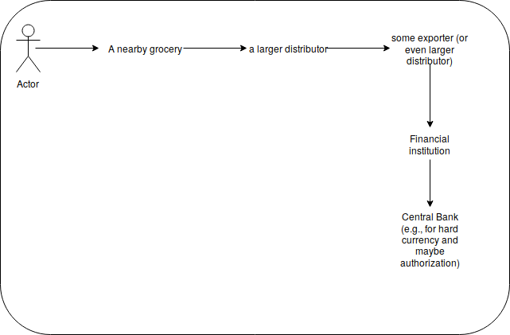

Table of Contents
=================

   * [Cash chain](#cash-chain)
      * [Why this is important and how it's relevant to our case -- how banks work?](#why-this-is-important-and-how-its-relevant-to-our-case----how-banks-work)
      * [Electronic payment](#electronic-payment)
      * [The system: EBS pride](#the-system-ebs-pride)
      * [The cash chain: Where's our money!](#the-cash-chain-wheres-our-money)
      * [Democratizing our e-payment: Beyond E15 realm](#democratizing-our-e-payment-beyond-e15-realm)

# Cash chain
_Bear in mind this is a work in-progress. I will keep this repo updated_.

One of the main issues we aim to solve is to secure the _cash chain_. This is why the government is heavily investing in epayment. As service providers, we gain our money by taking a small amount of the cash flow we're, well, securing.

## Why this is important and how it's relevant to our case -- how banks work?
You put your money into a bank, hopefully lots of you do. The bank then use these resources to funding other projects (e.g., microfinance). The bank, again hopefully, makes some revenue and all of our money is secured. The whole idea is that, while you put your money at a bank, it is highly unlikely you'd take the next day. It will stay still there for awhile which will allow the bank to use it. In  all of these cases I assumed we were using cash. What's happening now is that, the cash is in people's pockets and not the central bank.
_Now, imagine that our whole money, every fortune we have, is all stored in a centralized network, where _you_ can access them at anytime; the financial institutions where you save your money can also use them too; the central bank can use it in any state backed projects_. This is what we are eventually seeking to achieve. And this is actually how money works too. These papers are more or less represents a claim that you have this amout of fortune (and that the country also have its equivalent of e.g., gold).

With the arrive of new technologies, people have moved from bank accounts to electronic payment. And we here in Sudan are starting too.

## Electronic payment
Now, lets put those theories into practice. We have a national switch hosted and operated by EBS. It is connected to *all* banks. In essence, it has control of _all_ of the cash in the financial institutions. So, our problems are solved and clearly there's no reason writing this article, isn't it? Well not really. Very small amount of Sudanese have banks accounts. People are extensively using cash. Do we need to _first_ make a transfer into a banking system and then later makes the jump into the electronic one. Well, nah. There might be solution for that. We will get to this point later.
- tele corporates held lots of the cash mass (hence the controversial law of limiting the maximum amount of transactions per day)
- Mining markets
- Electricity
- Gas stations
We can assume that a high percentage of the cash is around these businesses, so we can start off there. Effectively, we want to take *all* of people's money, and give them _claims_ about it. Remember from the previous chapter about banking? It is really the same; we once replaced people's golds and silvers fortune with a piece of paper. That piece of paper is very handy you can grab it with you all along without noticing it. It is also backed by the law. You won't expect your grocery store to telling you that well your 50SDG is worthy 10SDG. Having the actual money in a centralized system, accessible to both banks and government, can hugely affect our economic. It gives concrete numbers of what you actually have and prevents inflitration. This is what _we_ all sought.

## The system: EBS pride
We have a national switch that connects *all* of financial institutions. It's very working and well tested. Oh, and secure too.
The aim of the switch, or EBS per se, is to be a thin wrapper around banks. It does the necessary authentications and ensures that every request that is passed onto the CBS layer is authenticated. It also handles the incoming transactions stemmed from different origins; POS, ATMs, mobiles. If you've ever worked with any financial institution, you'd know that this is something very huge! I've once started to implement ISO8583 protocol to connect with a CBS. It was a painful task. So we do actually have a great infrastructure but we are not taking fully advantage of it (and we will see why later).
_We have done everything right, but somehow... numbers don't add up_.

## The cash chain: Where's our money!
It wouldn't be much of a useful system, if you don't have users for it. If the system is not consumed. The cash, or most of it, is outside the system. Outside EBS and the banks as well. What worse than that is some of the cash is inside the system. We ended up having half-baked system. Now, as the government trying to dryout the cash and include it in the financial system. Needless to say, that went terribly bad. _We have only solved one part of the problem_. Building an electronic payment system is a huge work, but the ecosystem as a whole is broken. _We were very awesomly turned people's money into electronic ones--we failed though to let them make any use of it_.
I can use my bank card to pay for my internet and electricity bills. I can do all of the tele services (though there was a resistance from Zain side at first). Governmental services work well too. E15, CUSTOMS, Higher Education, etc. The _cash chain_ is complete, here.
What about other places? Purchase? It is broken. _This is why most of e-payment providers in Sudan solely focus on E15_. It is the only place where the cash chain is complete. Why they don't give as much care to e.g., telecom? Well, tele corporates have a huge network of agents, it is next to meaningless to try and compete with them. The government does, indeed, try to include them in the network (the controversial law of limiting the amount of transactions per day). If you as an e-payment provider, your whole intention is to work in E15 then your business model was right, you bet on the winner horse, well tell now at least. E15 is far more interesting than that too. You can, to some extent, have the transaction fees model you wish. And the stream of money is crazingly huge! But I'm arguning you that there's more of this story than the E15 one. That, if we played it well, it'll be beneficial for both of the corporates and the nation as a whole. And that this is a huge business opportunity to miss.

## Democratizing our e-payment: Beyond E15 realm
Unlike E15 or tele corporates, dealing with the people at a mass is quite different. And with this cash mess things are getting worse. It was hard to convince people to put their money in a 3-floor building, and now you just want them to put it in a plastic card! Wow!
Imagine this:
- your salary will be transfered to you into your credit card.
- you have this nice app on your phone where you can access your credit card and pay your bills.
- you can also use another app for shopping.
Well... apparently all of these are actually possible now. But, this doesn't sound like a Sudani thingy. So, what about these?
- pay to the bus that takes you to- and-from work
- pay to the tea/coffee ma'am you hangout with (during office hours)
- pay to your fatta and flafel
- the lame nearby (small) grocery you buy sugar and milk from?

Mmm, good luck with that. The idea is not about these only, it is about the small, yet, very often things you want to do. _This system is not personalized to our use_.
Now the banks are in utter need to have as much POS as they can afford, they've started tackling some of these problems. They put huge investment into distributing their POS into as many supermarkets as they can afford. That, will result in some revenue for them. However, there's no worse than a half-baked experience. The only way to convince a merchant (be it a supermarket or any other agent) to use your POS as a payment method is to ensure to them _that they can withdraw any amount of moeny they have_. And that's not possible. No one with their right mind can give you their money while they cannot have access to it. What we want is something like this:

